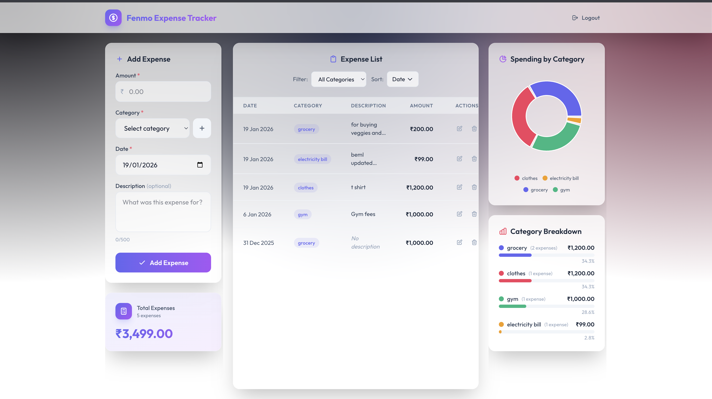

# 💰 Fenmo Expense Tracker

A modern expense tracking application with visual analytics and category-based organization.

🔗 **[Live Demo](https://fenmo-expense-tracker-frontend.onrender.com/)**

> **Test Credentials**  
> 📧 Email: `fenmo@fenmo.com`  
> 🔑 Password: `fenmo`  
> 
> Or create your own account from the signup page!

## 🎥 Demo

<video src="readme-assert/demo-video.webm" controls></video>

---

## 📸 Screenshots



---

## ✨ Features

- 🔐 **Secure Auth** — JWT-based signup & login
- 💸 **Expense CRUD** — Create, edit, delete with descriptions
- 🏷️ **Categories** — Custom expense categorization
- 📊 **Pie Charts** — Visual spending breakdown with Recharts
- 🔍 **Filter & Sort** — By category, date, or amount
- 📱 **Responsive** — Mobile-friendly design
- 🌐 **Offline Detection** — Network status indicator
- ⚡ **Skeleton Loaders** — Smooth loading states

---

## 🛠️ Tech Stack

| Frontend | Backend |
|----------|---------|
| React 19 | Express 5 |
| Vite 7 | TypeScript |
| TailwindCSS 4 | MySQL |
| Recharts | JWT + Bcrypt |

---

## 🚀 Quick Start

### Prerequisites
- Node.js v18+
- MySQL 8.0+

### Setup

```bash
# Clone the repo
git clone https://github.com/your-username/Fenmo-Expense-tracker.git
cd Fenmo-Expense-tracker

# Backend
cd backend
npm install
npm run dev

# Frontend (new terminal)
cd frontend
npm install
npm run dev
```

---

## 🗄️ Database Schema

```
users          categories       expenses
├── id (PK)    ├── id (PK)      ├── id (PK)
├── name       ├── name         ├── amount
├── email      ├── user_id ───► ├── description
├── password   └── timestamps   ├── date
└── timestamps                  ├── user_id
                                ├── category_id
                                └── timestamps
```

---

## 💡 Design Decisions

| Choice | Reason |
|--------|--------|
| **MySQL** | ACID compliance for financial data integrity |
| **JWT** | Stateless auth — no server-side sessions needed |
| **TypeScript** | Type safety for amounts & dates prevents runtime bugs |
| **Recharts** | React-native charting with smooth updates |
| **Submit Protection** | Button disabled during API calls to prevent duplicate submissions |

<p align="center">
  Built with ❤️ using React & Express
</p>
